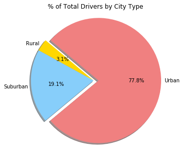

```python
# Environment Setup
# ----------------------------------------------------------------
# Dependencies
import plotly
import csv
import pandas as pd
import numpy as np
import matplotlib.pyplot as plt
#sizeref = 2 * max(array of size values) / (desired maximum marker size ** 2)


```


```python
city_csv_path = "raw_data/city_data.csv"
ride_csv_path = "raw_data/ride_data.csv"
```


```python
city_df = pd.read_csv(city_csv_path)
ride_df = pd.read_csv(ride_csv_path)
```


```python
#city_df
```


```python
#ride_df
rides_count_ride_df = pd.DataFrame(ride_df["city"].value_counts()) 
rides_count_ride_df.reset_index(inplace=True)
rides_count_ride_df.columns = ["city", "number of rides"]
rides_count_ride_df = rides_count_ride_df.reset_index()
#rides_count_ride_df
```


```python
merge_city_ride_count_df = pd.merge(rides_count_ride_df, city_df, on="city", how="outer")
#merge_city_ride_count_df
```


```python
grouped_ride_df_1 = pd.DataFrame(ride_df.groupby("city")["fare"].mean())
grouped_ride_df_1 = grouped_ride_df_1.rename(columns={"fare":"average fare"})
grouped_ride_df_2 = pd.DataFrame(ride_df.groupby("city")["fare"].sum())
grouped_ride_df_1.reset_index(inplace=True)
grouped_ride_df_2.reset_index(inplace=True)
grouped_ride_df = pd.merge(grouped_ride_df_1, grouped_ride_df_2, on="city", how="outer")
#grouped_ride_df
```


```python
final_merged_table = pd.merge(merge_city_ride_count_df, grouped_ride_df, on="city", how="outer")
#final_merged_table.head()
final_merged_table_urban = final_merged_table.loc[final_merged_table["type"] == "Urban",:]
final_merged_table_suburban = final_merged_table.loc[final_merged_table["type"] == "Suburban",:]
final_merged_table_rural = final_merged_table.loc[final_merged_table["type"] == "Rural",:]
```


```python
#############  Bubble  #####################
```


```python
fig = plt.figure(figsize=[10,10])
ax = fig.add_subplot(111)
urban_scatter = ax.scatter(final_merged_table_urban["number of rides"], final_merged_table_urban["average fare"], marker="o", facecolors="lightcoral", edgecolors="black", s=final_merged_table_urban["driver_count"]*10, alpha = 0.75, linewidths=1.5)
suburban_scatter = ax.scatter(final_merged_table_suburban["number of rides"], final_merged_table_suburban["average fare"], marker="o", facecolors="lightskyblue", edgecolors="black", s=final_merged_table_urban["driver_count"]*10, alpha = 0.75,linewidths=1.5)
urban_rural = ax.scatter(final_merged_table_rural["number of rides"], final_merged_table_rural["average fare"], marker="o", facecolors="gold", edgecolors="black", s=final_merged_table_urban["driver_count"]*10, alpha = 0.75,linewidths=1.5)
ax.set_facecolor("lightslategray")
plt.xlim(0,40)
plt.ylim(0,55)
plt.title("Pyber Ride Sharing Data")
plt.xlabel("Total Number of Rides (Per City)")
plt.ylabel("Average Fare ($)")

plt.legend((urban_scatter, suburban_scatter, urban_rural),
           ('Urban', 'Suburban', 'Rural'),
           scatterpoints=1,
           loc='upper right',
           ncol=1,
           fontsize=14)
```


    <matplotlib.legend.Legend at 0x11f3ec828>


```python
plt.grid(color='w', linestyle='-', linewidth=2,alpha=0.15)
plt.show()
```


```python
#############  PIE  #####################
```


```python
grouped_merge_for_pie = pd.DataFrame(final_merged_table.groupby("type")["fare","number of rides","driver_count", "average fare"].sum())
#grouped_merge_for_pie
```


```python
grouped_merge_for_pie.reset_index(inplace=True)
grouped_merge_for_pie 
```


<div>
<style>
    .dataframe thead tr:only-child th {
        text-align: right;
    }

    .dataframe thead th {
        text-align: left;
    }

    .dataframe tbody tr th {
        vertical-align: top;
    }
</style>
<table border="1" class="dataframe">
  <thead>
    <tr style="text-align: right;">
      <th></th>
      <th>type</th>
      <th>fare</th>
      <th>number of rides</th>
      <th>driver_count</th>
      <th>average fare</th>
    </tr>
  </thead>
  <tbody>
    <tr>
      <th>0</th>
      <td>Rural</td>
      <td>4255.09</td>
      <td>125</td>
      <td>104</td>
      <td>615.728572</td>
    </tr>
    <tr>
      <th>1</th>
      <td>Suburban</td>
      <td>20335.69</td>
      <td>657</td>
      <td>638</td>
      <td>1300.433953</td>
    </tr>
    <tr>
      <th>2</th>
      <td>Urban</td>
      <td>40078.34</td>
      <td>1625</td>
      <td>2607</td>
      <td>1623.863390</td>
    </tr>
  </tbody>
</table>
</div>


```python
import matplotlib as mpl
mpl.rcParams['font.size'] = 10.0
```


```python
colors = ["gold", "lightskyblue", "lightcoral"]
explode = (0, 0, 0.08)
labels = grouped_merge_for_pie["type"]
fig = plt.figure(figsize=[5,5])
ax = fig.add_subplot(111)
ax.pie(grouped_merge_for_pie["fare"], labels=labels, explode=explode, colors=colors, autopct="%1.1f%%", shadow=True, startangle=140, labeldistance=1.05)
ax.set_title("% of Total Fares by City Type")
```


    <matplotlib.text.Text at 0x11e187a90>


```python
plt.axis("equal")
```


    (-1.1167846560081485,
     1.1761024777814582,
     -1.1157351273861846,
     1.1525427749659682)


```python
plt.show()
```


```python
colors = ["gold", "lightskyblue", "lightcoral"]
explode = (0, 0, 0.08)
labels = grouped_merge_for_pie["type"]
fig = plt.figure(figsize=[5,5])
ax = fig.add_subplot(111)
ax.pie(grouped_merge_for_pie["number of rides"], labels=labels, explode=explode, colors=colors, autopct="%1.1f%%", shadow=True, startangle=140, labeldistance=1.05)
ax.set_title("% of Total Rides by City Type")
```


    <matplotlib.text.Text at 0x11f155710>


```python
plt.axis("equal")
```


    (-1.1114212560216008,
     1.1959203150236031,
     -1.0904622806333382,
     1.1424608772110354)


```python
plt.show()
```


```python
colors = ["gold", "lightskyblue", "lightcoral"]
explode = (0, 0, 0.08)
labels = grouped_merge_for_pie["type"]
fig = plt.figure(figsize=[5,5])
ax = fig.add_subplot(111)
ax.pie(grouped_merge_for_pie["driver_count"], labels=labels, explode=explode, colors=colors, autopct="%1.1f%%", shadow=True, startangle=140, labeldistance=1.05)
ax.set_title("% of Total Drivers by City Type")
```


    <matplotlib.text.Text at 0x11e526748>


```python
plt.axis("equal")
```


    (-1.1193451288312446,
     1.1849512320808815,
     -1.1038070776183508,
     1.103722383970873)


```python
plt.show()
```




